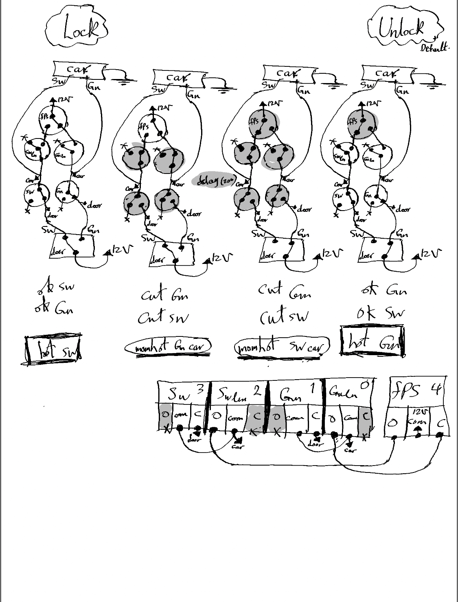
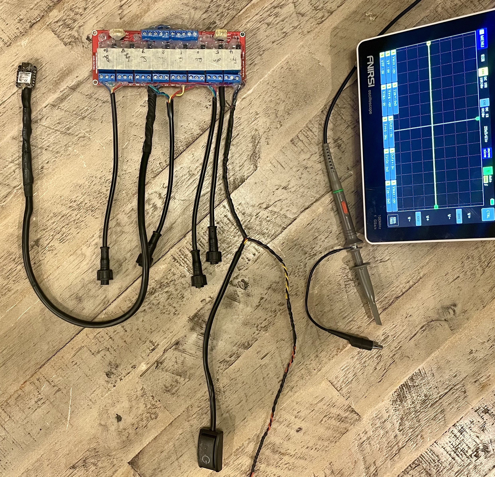

# 007
I aimed to transform my 007 roadster into a true James Bond vehicle, infusing it with futuristic functionalities modernizing this quarter-century-old sports car. Pioneering the initiative, I conceived and executed cutting-edge embedded systems, integrating features like fingerprint-based ignition, facial recognition media access, smart home synchronization, and proximity sensing capabilities. Upon achieving these objectives, I redirected my focus to tackling issues associated with smart home automation, revamping gadgets using the open-source Matter platform to harmonize my C-based code with the Apple HomeKit protocol. Utilizing esp32 chips and FPGAs for peripheral management, I independently funded and motivated an original car automation project. Leveraging the accessibility of development chips, I seamlessly integrated peripherals into development chips, effectively incorporating these standalone embedded systems into my 007 roadster. As a result, I now possess the ability to arm, operate, and oversee the vehicle using my fingerprint or via my smartphone through Siri protocol. This cost-effective yet dependable solution extends beyond personal transportation, offering enhanced security applications for homes, deposit boxes, and weapon security, among others. (July.22.2022)

# Circuit

# Hardware

https://www.instructables.com/Accessing-My-Z3-Roadster-With-Fingerprint-Siri/
